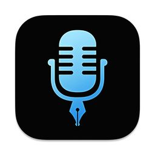

  
  <h1>VoiceLink Community</h1>
  
macOS voice-to-text without paywalls, trials, or API key juggling

  
  

---

VoiceLink Community is a maintained fork of the original VoiceInk project focused on a fully unlocked, offline-first macOS transcription workflow. It keeps the privacy-first core, bundles local models, and adds community-friendly defaults for features like Power Mode, Text-to-Speech, and rapid keyboard control.

Highlights of this fork:

- 💸 **Fully unlocked** – no trials, license prompts, or gated features.
- 📦 **Models included** – Whisper (multiple sizes) and Parakeet ship in the app, ready to use offline.
- 🔧 **Hackable by default** – a friendlier contributing policy and cleaner onboarding for builders.

## Features

- 🎙️ **Offline transcription** – Whisper, Parakeet, and Apple Speech models are bundled and ready on first launch.
- 🔊 **Text-to-speech studio** – Create narration with OpenAI, ElevenLabs, Google Cloud, or local system voices, complete with previews, batch queueing, translation, and article import tools.
- 🔒 **Privacy first** – audio and transcripts stay local unless you explicitly export them.
- ⚡ **Power Mode** – detect the active app/URL and auto-apply prompts, models, and paste rules.
- 🎯 **Global shortcuts** – flexible hotkeys, push-to-talk, and middle-click control.
- 📝 **Custom vocabulary** – dictionaries, word replacements, and CSV import/export.
- 💬 **Optional enhancements** – local formatting works out of the box; Ollama hooks stay available for power users.

## Get Started

### Download or Build

- **Releases** – check the repository releases tab for notarized builds of the community edition.
- **Homebrew (optional)** – once a tap is available you’ll be able to `brew install --cask voiceink-community`.
- **From source** – follow [Building from Source](docs/development/BUILDING.md) to compile the app with Xcode. Run `./scripts/download-models.sh` beforehand to drop the default Whisper binaries into the bundle if you haven’t downloaded them yet.

## Requirements

- macOS 14.4 or later

## Documentation

- [Building from Source](docs/development/BUILDING.md) - Detailed build setup and signing notes
- [Documentation Index](docs/README.md) - Feature guides, development docs, plans, and audits
- [Power Mode Guide](docs/POWER_MODE_GUIDE.md) - Context-aware automation by app or URL
- [Text-to-Speech Workspace Guide](docs/TTS_WORKSPACE_GUIDE.md) - Narration, batch generation, and export
- [AI Enhancement Guide](docs/AI_ENHANCEMENT_GUIDE.md) - Providers, prompts, and context settings
- [Keyboard Shortcuts Guide](docs/KEYBOARD_SHORTCUTS_GUIDE.md) - Hotkeys, push-to-talk, and actions
- [Dictionary Guide](docs/DICTIONARY_GUIDE.md) - Quick rules, replacements, and vocabulary
- [Model Management Guide](docs/MODEL_MANAGEMENT_GUIDE.md) - Local, cloud, and custom models
- [Data Management Guide](docs/DATA_MANAGEMENT_GUIDE.md) - History, export, and cleanup
- [Contributing Guidelines](CONTRIBUTING.md) - How to contribute to VoiceLink Community
- [Code of Conduct](CODE_OF_CONDUCT.md) - Our community standards
- [Rectifications & Improvements](docs/implementation/VOICELINK_COMMUNITY_REMEDIATIONS.md) - Security and performance fixes applied to the community edition
- [Changelog](CHANGELOG.md) - Release-by-release changes

## Rectifications & Improvements

Recent stability, security, and performance improvements are documented in
[Rectifications & Improvements](docs/implementation/VOICELINK_COMMUNITY_REMEDIATIONS.md). Highlights include:

- ✅ HTTPS validation for custom AI provider verification.
- ✅ Non-blocking audio file handling for cloud transcription.
- ✅ Reduced main-thread hopping in `@MainActor` classes.
- ✅ Removal of forced `UserDefaults.synchronize()` in hot paths.
- ✅ Streamed audio preprocessing and transcription uploads to reduce memory.
- ✅ Disk-cached recent TTS history audio with size limits and cleanup.

### Recent Changes (2026-03-06)
- Upstream sync: incorporated latest `Beingpax/VoiceInk` changes while preserving community-specific settings flow, hotkey behavior, and transcription defaults.
- Architecture: kept the established `WhisperState`-driven app flow and deliberately dropped the partially merged upstream engine/manager stack where it would have changed core fork behavior.
- Build tooling: repaired the Xcode project merge state, synced the SwiftPM lockfile (including `mediaremote-adapter`), and verified a successful Debug build locally.

### Recent Changes (2025-12-20)
- Performance: streamed audio preprocessing and transcription uploads.
- Memory: capped OCR/browser context and stored AI request payloads.
- Storage: cached recent TTS history audio on disk with size limits.

## Contributing

Pull requests are welcome without prior approval. Read the lightweight [CONTRIBUTING.md](CONTRIBUTING.md) for tips, spin up a branch, and open a PR when ready. If you want early feedback, drafts and GitHub Discussions are perfect places to start the conversation.

## License

This project is licensed under the GNU General Public License v3.0 - see the [LICENSE](LICENSE) file for details.

## Support

If you run into trouble:
1. Search existing GitHub issues and discussions.
2. Open a new issue with logs, screenshots, or steps to reproduce.
3. Start a GitHub Discussion for quick questions or pairing sessions.

## Acknowledgments

### Core Technology
- [whisper.cpp](https://github.com/ggerganov/whisper.cpp) - High-performance inference of OpenAI's Whisper model
- [FluidAudio](https://github.com/FluidInference/FluidAudio) - Used for Parakeet model implementation

### Essential Dependencies
- [Sparkle](https://github.com/sparkle-project/Sparkle) - Keeping VoiceLink Community up to date
- [KeyboardShortcuts](https://github.com/sindresorhus/KeyboardShortcuts) - User-customizable keyboard shortcuts
- [LaunchAtLogin](https://github.com/sindresorhus/LaunchAtLogin) - Launch at login functionality
- [MediaRemoteAdapter](https://github.com/ejbills/mediaremote-adapter) - Media playback control during recording
- [Zip](https://github.com/marmelroy/Zip) - File compression and decompression utilities
- [SelectedTextKit](https://github.com/tisfeng/SelectedTextKit) - A modern macOS library for getting selected text
- [Swift Atomics](https://github.com/apple/swift-atomics) - Low-level atomic operations for thread-safe concurrent programming

---

Maintained with ❤️ by the VoiceLink Community
