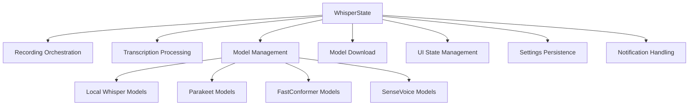
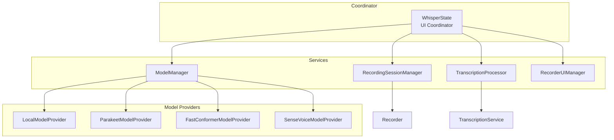

# WhisperState SOLID Refactoring Plan

## Executive Summary

This document outlines a comprehensive refactoring plan for the `WhisperState` class to apply SOLID principles, specifically the Single Responsibility Principle (SRP). The current implementation spans ~1,200 lines across 9 files and handles multiple distinct responsibilities that should be separated into focused, testable components.

---

## Current State Analysis

### File Structure

| File | Lines | Primary Responsibility |
|------|-------|----------------------|
| `WhisperState.swift` | 158 | Core state, initialization, properties |
| `WhisperState+Recording.swift` | 343 | Recording flow, transcription orchestration |
| `WhisperState+LocalModelManager.swift` | 446 | Model download, delete, import, directory management |
| `WhisperState+ModelQueries.swift` | 50 | Model availability queries |
| `WhisperState+ModelManagement.swift` | 52 | Model selection, persistence |
| `WhisperState+UI.swift` | 145 | Recorder panel, notifications |
| `WhisperState+Parakeet.swift` | 105 | Parakeet model management |
| `WhisperState+FastConformer.swift` | 103 | FastConformer model management |
| `WhisperState+SenseVoice.swift` | 112 | SenseVoice model management |
| **Total** | **~1,514** | |

### Identified Responsibilities (SRP Violations)

The `WhisperState` class currently handles **7 distinct responsibilities**:



#### 1. Recording Orchestration
- `toggleRecord()` - Start/stop recording flow
- `requestRecordPermission()` - Permission handling
- Recording state machine management

#### 2. Transcription Processing
- `transcribeAudio()` - Full transcription pipeline
- Service selection based on model provider
- AI enhancement integration
- Text formatting and word replacement

#### 3. Model Management (Local Whisper)
- `loadModel()` - Load Whisper context
- `deleteModel()` - Remove model files
- `unloadModel()` - Release resources
- `importLocalModel()` - Import user models
- `loadAvailableModels()` - Scan directory

#### 4. Model Download
- `downloadModel()` - Download with progress
- `downloadFileWithProgress()` - Generic download helper
- CoreML model handling
- Zip extraction

#### 5. Alternative Model Management
- Parakeet: download, delete, status checks
- FastConformer: download, delete, status checks
- SenseVoice: download, delete, status checks

#### 6. UI State Management
- `showRecorderPanel()` / `hideRecorderPanel()`
- `toggleMiniRecorder()` / `dismissMiniRecorder()`
- Window manager coordination
- `isMiniRecorderVisible` state

#### 7. Settings & Persistence
- `loadCurrentTranscriptionModel()` - Load from UserDefaults
- `setDefaultTranscriptionModel()` - Save to UserDefaults
- `refreshAllAvailableModels()` - Sync state

---

## Proposed Architecture

### High-Level Design



### New Components

#### 1. RecordingSessionManager
**Responsibility:** Orchestrate the recording lifecycle

```swift
@MainActor
class RecordingSessionManager: ObservableObject {
    @Published var state: RecordingState = .idle
    @Published var shouldCancel = false
    
    private let recorder: Recorder
    private let recordingsDirectory: URL
    private weak var delegate: RecordingSessionDelegate?
    
    func startSession() async throws -> URL
    func stopSession() async -> URL?
    func cancelSession() async
}

protocol RecordingSessionDelegate: AnyObject {
    func sessionDidStart()
    func sessionDidComplete(audioURL: URL)
    func sessionDidCancel()
    func sessionDidFail(error: Error)
}
```

#### 2. TranscriptionProcessor
**Responsibility:** Process audio through transcription pipeline

```swift
@MainActor
class TranscriptionProcessor: ObservableObject {
    @Published var isProcessing = false
    
    private let serviceRegistry: TranscriptionServiceRegistry
    private let enhancementService: AIEnhancementService?
    private let promptDetectionService: PromptDetectionService
    
    func process(
        audioURL: URL,
        model: any TranscriptionModel,
        transcription: Transcription
    ) async throws -> TranscriptionResult
}

struct TranscriptionResult {
    let text: String
    let enhancedText: String?
    let duration: TimeInterval
    let transcriptionDuration: TimeInterval
    let enhancementDuration: TimeInterval?
    let modelName: String
    let promptName: String?
}
```

#### 3. ModelManager
**Responsibility:** Coordinate all model types through providers

```swift
@MainActor
class ModelManager: ObservableObject {
    @Published var availableModels: [any TranscriptionModel] = []
    @Published var currentModel: (any TranscriptionModel)?
    @Published var downloadProgress: [String: Double] = [:]
    
    private let providers: [ModelProvider: any ModelProviderProtocol]
    
    func loadAvailableModels()
    func setCurrentModel(_ model: any TranscriptionModel)
    func downloadModel(_ model: any TranscriptionModel) async
    func deleteModel(_ model: any TranscriptionModel) async
    func isModelDownloaded(_ model: any TranscriptionModel) -> Bool
    func isModelDownloading(_ model: any TranscriptionModel) -> Bool
}

protocol ModelProviderProtocol {
    var provider: ModelProvider { get }
    var modelsDirectory: URL { get }
    
    func loadAvailableModels() -> [any TranscriptionModel]
    func isDownloaded(_ model: any TranscriptionModel) -> Bool
    func download(_ model: any TranscriptionModel) async throws
    func delete(_ model: any TranscriptionModel) async throws
    func showInFinder(_ model: any TranscriptionModel)
}
```

#### 4. LocalModelProvider
**Responsibility:** Manage local Whisper models

```swift
@MainActor
class LocalModelProvider: ModelProviderProtocol {
    let provider: ModelProvider = .local
    let modelsDirectory: URL
    
    @Published var whisperModels: [WhisperModel] = []
    
    func loadAvailableModels() -> [any TranscriptionModel]
    func isDownloaded(_ model: any TranscriptionModel) -> Bool
    func download(_ model: any TranscriptionModel) async throws
    func delete(_ model: any TranscriptionModel) async throws
    func importModel(from url: URL) async throws
    func showInFinder(_ model: any TranscriptionModel)
}
```

#### 5. ParakeetModelProvider, FastConformerModelProvider, SenseVoiceModelProvider
**Responsibility:** Manage respective model types (similar structure)

```swift
@MainActor
class ParakeetModelProvider: ModelProviderProtocol {
    let provider: ModelProvider = .parakeet
    // Similar interface to LocalModelProvider
}
```

#### 6. RecorderUIManager
**Responsibility:** Manage recorder window presentation

```swift
@MainActor
class RecorderUIManager: ObservableObject {
    @Published var isVisible = false
    @Published var recorderType: String = "mini"
    
    private var notchWindowManager: NotchWindowManager?
    private var miniWindowManager: MiniWindowManager?
    
    func show()
    func hide()
    func toggle()
}
```

#### 7. WhisperContextManager (Actor)
**Responsibility:** Thread-safe Whisper context management

```swift
actor WhisperContextManager {
    private var context: WhisperContext?
    private var loadedModelName: String?
    
    func loadContext(for model: WhisperModel) async throws
    func getContext() -> WhisperContext?
    func releaseContext() async
    func setPrompt(_ prompt: String) async
    var isLoaded: Bool { get }
}
```

---

## Refactored WhisperState

After extraction, `WhisperState` becomes a thin coordinator:

```swift
@MainActor
class WhisperState: NSObject, ObservableObject {
    // MARK: - Published State (UI Binding)
    @Published var recordingState: RecordingState = .idle
    @Published var clipboardMessage = ""
    @Published var miniRecorderError: String?
    
    // MARK: - Dependencies
    let recordingSession: RecordingSessionManager
    let transcriptionProcessor: TranscriptionProcessor
    let modelManager: ModelManager
    let recorderUI: RecorderUIManager
    let contextManager: WhisperContextManager
    
    // MARK: - External Dependencies
    let modelContext: ModelContext
    let enhancementService: AIEnhancementService?
    var licenseViewModel: LicenseViewModel
    
    // MARK: - Computed Properties (Delegation)
    var currentTranscriptionModel: (any TranscriptionModel)? {
        get { modelManager.currentModel }
        set { modelManager.setCurrentModel(newValue) }
    }
    
    var availableModels: [WhisperModel] {
        modelManager.localProvider.whisperModels
    }
    
    var isMiniRecorderVisible: Bool {
        get { recorderUI.isVisible }
        set { recorderUI.isVisible = newValue }
    }
    
    // MARK: - Initialization
    init(modelContext: ModelContext, enhancementService: AIEnhancementService? = nil) {
        // Initialize all managers with dependencies
    }
    
    // MARK: - Public API (Delegation)
    func toggleRecord() async {
        // Delegate to recordingSession and transcriptionProcessor
    }
    
    func toggleMiniRecorder() async {
        // Delegate to recorderUI and recordingSession
    }
}
```

---

## Migration Strategy

### Phase 1: Extract Model Providers (Low Risk)

**Goal:** Extract model-specific logic without changing public API

1. Create `LocalModelProvider` from `WhisperState+LocalModelManager.swift`
2. Create `ParakeetModelProvider` from `WhisperState+Parakeet.swift`
3. Create `FastConformerModelProvider` from `WhisperState+FastConformer.swift`
4. Create `SenseVoiceModelProvider` from `WhisperState+SenseVoice.swift`
5. Create `ModelManager` to coordinate providers
6. Update `WhisperState` to delegate to `ModelManager`

**Backward Compatibility:**
- Keep existing extension files as thin wrappers
- Deprecate direct method calls with `@available(*, deprecated)`

### Phase 2: Extract Recording Session (Medium Risk)

**Goal:** Separate recording lifecycle from transcription

1. Create `RecordingSessionManager`
2. Move recording state machine logic
3. Define `RecordingSessionDelegate` protocol
4. Update `WhisperState` to implement delegate

**Backward Compatibility:**
- `toggleRecord()` remains on `WhisperState`
- Internal implementation delegates to `RecordingSessionManager`

### Phase 3: Extract Transcription Processor (Medium Risk)

**Goal:** Isolate transcription pipeline

1. Create `TranscriptionProcessor`
2. Move `transcribeAudio()` logic
3. Create `TranscriptionServiceRegistry` for service lookup
4. Integrate with `RecordingSessionManager` via delegate

**Backward Compatibility:**
- Transcription flow unchanged from caller perspective
- Internal orchestration moves to new classes

### Phase 4: Extract UI Manager (Low Risk)

**Goal:** Separate window management

1. Create `RecorderUIManager`
2. Move window manager references
3. Move `showRecorderPanel()` / `hideRecorderPanel()`
4. Update `WhisperState` to delegate

**Backward Compatibility:**
- `isMiniRecorderVisible` remains as computed property
- Window behavior unchanged

### Phase 5: Create WhisperContextManager Actor (Medium Risk)

**Goal:** Thread-safe context management

1. Create `WhisperContextManager` actor
2. Move `whisperContext` management
3. Update `LocalTranscriptionService` to use actor
4. Remove direct context access from `WhisperState`

**Backward Compatibility:**
- Context access through actor methods
- Existing async patterns preserved

---

## Dependency Injection Design

### Container Pattern

```swift
@MainActor
class WhisperDependencyContainer {
    // Directories
    let modelsDirectory: URL
    let fastConformerDirectory: URL
    let senseVoiceDirectory: URL
    let recordingsDirectory: URL
    
    // Core Services
    lazy var recorder = Recorder()
    lazy var contextManager = WhisperContextManager()
    
    // Model Providers
    lazy var localProvider = LocalModelProvider(
        modelsDirectory: modelsDirectory,
        contextManager: contextManager
    )
    lazy var parakeetProvider = ParakeetModelProvider()
    lazy var fastConformerProvider = FastConformerModelProvider(
        modelsDirectory: fastConformerDirectory
    )
    lazy var senseVoiceProvider = SenseVoiceModelProvider(
        modelsDirectory: senseVoiceDirectory
    )
    
    // Managers
    lazy var modelManager = ModelManager(
        providers: [
            .local: localProvider,
            .parakeet: parakeetProvider,
            .fastConformer: fastConformerProvider,
            .senseVoice: senseVoiceProvider
        ]
    )
    
    lazy var recordingSession = RecordingSessionManager(
        recorder: recorder,
        recordingsDirectory: recordingsDirectory
    )
    
    lazy var transcriptionProcessor = TranscriptionProcessor(
        serviceRegistry: TranscriptionServiceRegistry(),
        enhancementService: nil // Injected separately
    )
    
    lazy var recorderUI = RecorderUIManager()
    
    init() {
        let appSupport = FileManager.default.urls(
            for: .applicationSupportDirectory,
            in: .userDomainMask
        )[0].appendingPathComponent("com.tmm22.VoiceLinkCommunity")
        
        modelsDirectory = appSupport.appendingPathComponent("WhisperModels")
        fastConformerDirectory = appSupport.appendingPathComponent("FastConformer")
        senseVoiceDirectory = appSupport.appendingPathComponent("SenseVoice")
        recordingsDirectory = appSupport.appendingPathComponent("Recordings")
    }
}
```

### WhisperState Initialization

```swift
@MainActor
class WhisperState: NSObject, ObservableObject {
    private let container: WhisperDependencyContainer
    
    init(
        modelContext: ModelContext,
        enhancementService: AIEnhancementService? = nil,
        container: WhisperDependencyContainer = WhisperDependencyContainer()
    ) {
        self.container = container
        self.modelContext = modelContext
        self.enhancementService = enhancementService
        
        // Configure dependencies
        container.transcriptionProcessor.enhancementService = enhancementService
        
        super.init()
        
        // Setup...
    }
}
```

---

## File Organization

### New Directory Structure

```
VoiceInk/
├── Whisper/
│   ├── WhisperState.swift                    # Thin coordinator
│   ├── WhisperContext.swift                  # Existing
│   ├── WhisperError.swift                    # Existing
│   ├── WhisperPrompt.swift                   # Existing
│   ├── WhisperTextFormatter.swift            # Existing
│   │
│   ├── Managers/
│   │   ├── WhisperContextManager.swift       # NEW: Actor for context
│   │   ├── RecordingSessionManager.swift     # NEW: Recording lifecycle
│   │   ├── TranscriptionProcessor.swift      # NEW: Transcription pipeline
│   │   ├── RecorderUIManager.swift           # NEW: Window management
│   │   └── ModelManager.swift                # NEW: Model coordination
│   │
│   ├── ModelProviders/
│   │   ├── ModelProviderProtocol.swift       # NEW: Provider interface
│   │   ├── LocalModelProvider.swift          # NEW: Whisper models
│   │   ├── ParakeetModelProvider.swift       # NEW: Parakeet models
│   │   ├── FastConformerModelProvider.swift  # NEW: FastConformer models
│   │   └── SenseVoiceModelProvider.swift     # NEW: SenseVoice models
│   │
│   ├── Models/
│   │   └── WhisperModel.swift                # Extracted from LocalModelManager
│   │
│   └── Legacy/                               # Deprecated wrappers
│       ├── WhisperState+Recording.swift      # Thin wrapper
│       ├── WhisperState+LocalModelManager.swift
│       ├── WhisperState+ModelQueries.swift
│       ├── WhisperState+ModelManagement.swift
│       ├── WhisperState+UI.swift
│       ├── WhisperState+Parakeet.swift
│       ├── WhisperState+FastConformer.swift
│       └── WhisperState+SenseVoice.swift
```

---

## Testing Strategy

### Unit Tests for New Components

```swift
// ModelManagerTests.swift
@MainActor
final class ModelManagerTests: XCTestCase {
    var sut: ModelManager!
    var mockLocalProvider: MockLocalModelProvider!
    
    override func setUp() async throws {
        mockLocalProvider = MockLocalModelProvider()
        sut = ModelManager(providers: [.local: mockLocalProvider])
    }
    
    func testLoadAvailableModels() async {
        // Given
        mockLocalProvider.stubbedModels = [MockModel()]
        
        // When
        sut.loadAvailableModels()
        
        // Then
        XCTAssertEqual(sut.availableModels.count, 1)
    }
}

// RecordingSessionManagerTests.swift
@MainActor
final class RecordingSessionManagerTests: XCTestCase {
    func testStartSession_CreatesAudioFile() async throws {
        // Given
        let mockRecorder = MockRecorder()
        let sut = RecordingSessionManager(
            recorder: mockRecorder,
            recordingsDirectory: tempDirectory
        )
        
        // When
        let url = try await sut.startSession()
        
        // Then
        XCTAssertTrue(url.path.contains("Recordings"))
        XCTAssertEqual(sut.state, .recording)
    }
}
```

### Integration Tests

```swift
// WhisperStateIntegrationTests.swift
@MainActor
final class WhisperStateIntegrationTests: XCTestCase {
    func testToggleRecord_CompletesTranscription() async throws {
        // Given
        let container = TestDependencyContainer()
        let sut = WhisperState(
            modelContext: testContext,
            container: container
        )
        
        // When
        await sut.toggleRecord() // Start
        try await Task.sleep(for: .seconds(1))
        await sut.toggleRecord() // Stop
        
        // Then
        XCTAssertEqual(sut.recordingState, .idle)
    }
}
```

---

## Backward Compatibility

### Deprecation Strategy

```swift
// WhisperState+Recording.swift (Legacy)
extension WhisperState {
    @available(*, deprecated, message: "Use recordingSession.startSession() instead")
    func toggleRecord() async {
        // Delegate to new implementation
        if recordingState == .recording {
            await recordingSession.stopSession()
        } else {
            try? await recordingSession.startSession()
        }
    }
}
```

### Public API Preservation

All existing public methods remain available:
- `toggleRecord()` → Delegates to `RecordingSessionManager`
- `downloadModel()` → Delegates to `ModelManager`
- `deleteModel()` → Delegates to `ModelManager`
- `toggleMiniRecorder()` → Delegates to `RecorderUIManager`

---

## Risk Assessment

| Phase | Risk Level | Mitigation |
|-------|------------|------------|
| 1. Model Providers | Low | Pure extraction, no behavior change |
| 2. Recording Session | Medium | Comprehensive testing, feature flags |
| 3. Transcription Processor | Medium | Integration tests, gradual rollout |
| 4. UI Manager | Low | Simple delegation |
| 5. Context Actor | Medium | Actor isolation testing |

---

## Implementation Checklist

### Phase 1: Model Providers
- [ ] Create `ModelProviderProtocol`
- [ ] Extract `WhisperModel` struct to separate file
- [ ] Create `LocalModelProvider`
- [ ] Create `ParakeetModelProvider`
- [ ] Create `FastConformerModelProvider`
- [ ] Create `SenseVoiceModelProvider`
- [ ] Create `ModelManager`
- [ ] Update `WhisperState` to use `ModelManager`
- [ ] Add unit tests for each provider
- [ ] Deprecate old extension methods

### Phase 2: Recording Session
- [ ] Create `RecordingSessionManager`
- [ ] Define `RecordingSessionDelegate`
- [ ] Move recording state machine
- [ ] Update `WhisperState` to delegate
- [ ] Add unit tests
- [ ] Integration test recording flow

### Phase 3: Transcription Processor
- [ ] Create `TranscriptionProcessor`
- [ ] Create `TranscriptionServiceRegistry`
- [ ] Move transcription pipeline logic
- [ ] Integrate with `RecordingSessionManager`
- [ ] Add unit tests
- [ ] Integration test full flow

### Phase 4: UI Manager
- [ ] Create `RecorderUIManager`
- [ ] Move window manager references
- [ ] Update `WhisperState` to delegate
- [ ] Add unit tests

### Phase 5: Context Actor
- [ ] Create `WhisperContextManager` actor
- [ ] Update `LocalTranscriptionService`
- [ ] Update `LocalModelProvider`
- [ ] Add actor isolation tests

---

## Success Metrics

1. **Code Organization**
   - Each new class < 300 lines
   - Single responsibility per class
   - Clear dependency graph

2. **Testability**
   - 80%+ code coverage for new components
   - All components mockable
   - No direct singleton access in new code

3. **Maintainability**
   - Adding new model provider requires only new `ModelProviderProtocol` implementation
   - Recording flow changes isolated to `RecordingSessionManager`
   - UI changes isolated to `RecorderUIManager`

4. **Backward Compatibility**
   - All existing public API preserved
   - No breaking changes for consumers
   - Gradual deprecation path

---

## Appendix: Current Method Inventory

### WhisperState.swift
- `init(modelContext:enhancementService:)`
- `createRecordingsDirectoryIfNeeded()`

### WhisperState+Recording.swift
- `toggleRecord()`
- `requestRecordPermission(response:)`
- `transcribeAudio(on:)`
- `getEnhancementService()`
- `checkCancellationAndCleanup()`
- `cleanupAndDismiss()`

### WhisperState+LocalModelManager.swift
- `createModelsDirectoryIfNeeded()`
- `createFastConformerDirectoryIfNeeded()`
- `createSenseVoiceDirectoryIfNeeded()`
- `loadAvailableModels()`
- `loadModel(_:)`
- `downloadFileWithProgress(from:to:progressKey:progressUpdate:)`
- `downloadModel(_:)`
- `deleteModel(_:)`
- `unloadModel()`
- `clearDownloadedModels()`
- `cleanupModelResources()`
- `importLocalModel(from:)`

### WhisperState+ModelQueries.swift
- `usableModels` (computed property)

### WhisperState+ModelManagement.swift
- `loadCurrentTranscriptionModel()`
- `setDefaultTranscriptionModel(_:)`
- `refreshAllAvailableModels()`

### WhisperState+UI.swift
- `showRecorderPanel()`
- `hideRecorderPanel()`
- `toggleMiniRecorder()`
- `dismissMiniRecorder()`
- `resetOnLaunch()`
- `cancelRecording()`
- `setupNotifications()`
- `handleToggleMiniRecorder()`
- `handleDismissMiniRecorder()`
- `handleLicenseStatusChanged()`
- `handlePromptChange()`
- `updateContextPrompt()`

### WhisperState+Parakeet.swift
- `isParakeetModelDownloaded(named:)`
- `isParakeetModelDownloaded(_:)`
- `isParakeetModelDownloading(_:)`
- `downloadParakeetModel(_:)`
- `deleteParakeetModel(_:)`
- `showParakeetModelInFinder(_:)`

### WhisperState+FastConformer.swift
- `isFastConformerModelDownloaded(_:)`
- `downloadFastConformerModel(_:)`
- `deleteFastConformerModel(_:)`
- `showFastConformerModelInFinder(_:)`

### WhisperState+SenseVoice.swift
- `isSenseVoiceModelDownloaded(_:)`
- `downloadSenseVoiceModel(_:)`
- `deleteSenseVoiceModel(_:)`
- `showSenseVoiceModelInFinder(_:)`
